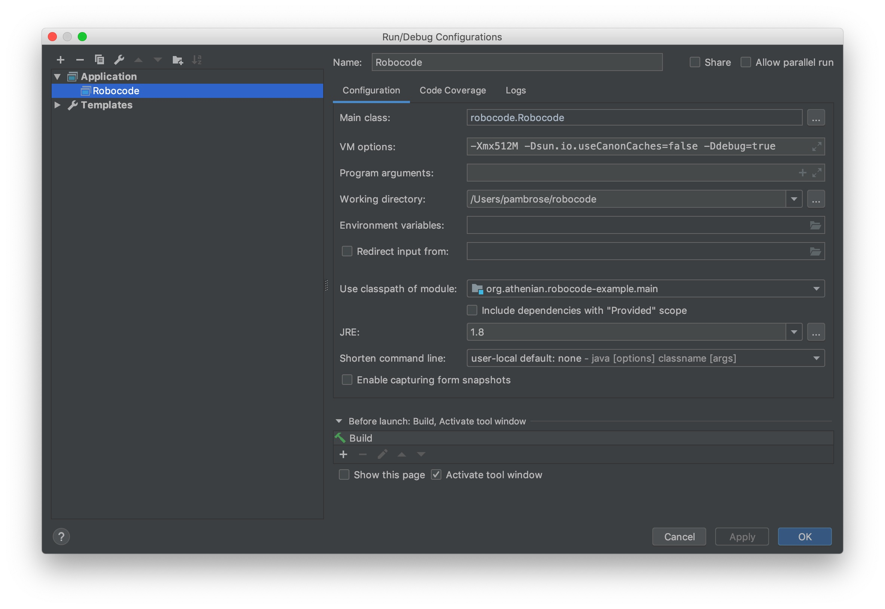
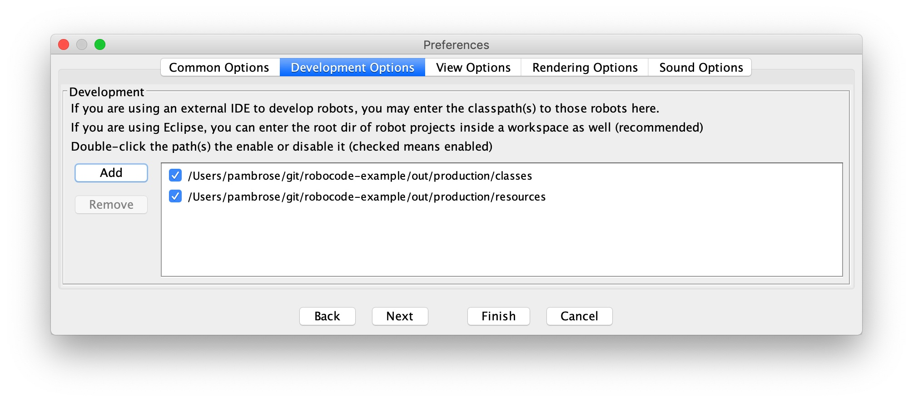

# Robocode Example

## Setup
1) Download the *robocode-1.9.3.4-setup.jar* from [here](https://sourceforge.net/projects/robocode/files/).

2) Run the setup jar and install Robocode into your home dir with:

```bash
java -jar robocode-1.9.3.4-setup.jar
```

3) Clone this repo and open it with IntelliJ

4) Create an IntelliJ Application configurations with these values:

```
Name: Robocode
Main class: robocode.Robocode
VM options: -Xmx512M -Dsun.io.useCanonCaches=false -Ddebug=true
Working directory: /Users/username/robocode 
Use classpath of module: org.athenian.robocode-example.main
JRE: 1.8
```



5) Run the newly created configuration to start Robocode.

6) Once started, select *Options* -> *Preferences* -> *Development Options* and
add **robocode-example/out/production/classes** and **robocode-example/out/production/resources**
and click *Finish*.


